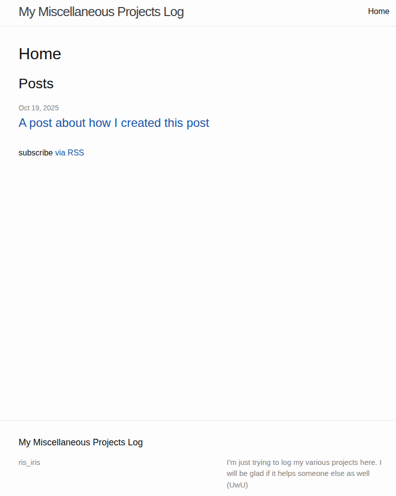

Ok, so I decided to start a blog. And I decided to use Github Pages for this purpose. This post is documenting my attempt at creating this post and the blog in general (and I find it quite funny).

## Initial setup
It's really easy, you just go to [the documentation](https://docs.github.com/en/pages/quickstart) and do what you are asked to do.
I additionally tried to add ``description`` field to my ``_config.yml`` to see what happens.

After this step, my newborn blog looked like this:

    
A side note on HTML markups

    
To add an image to the post, you can:

    <ol>
    <li>Create a folder <code>images</code> in the repo and add an image there</li>
    <li>Add an image with <code>&lt;img src=&quot;relative-path-to-images/your-image-file&quot;/&gt;</code></li>
    </ol>
    
To create a toggle use:

    <pre><code>```
    &lt;details&gt;
      &lt;summary&gt;A side note on HTML markups&lt;/summary&gt;
      And here is how you do it
    &lt;/details&gt;
    ```
    </code></pre>
  
And, apparently, you can not use markdown inside the markup part, so if you are not fluent in HTML, use a converter like this one: https://markdowntohtml.com/

## Now, what do I do next
